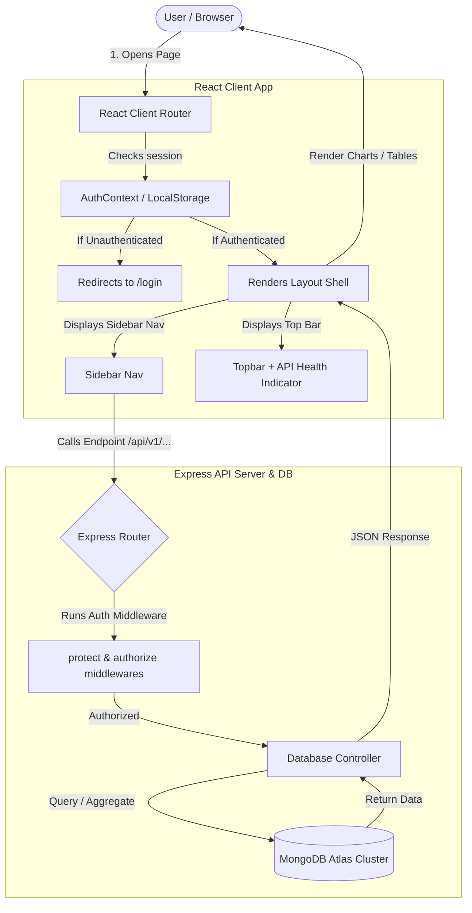
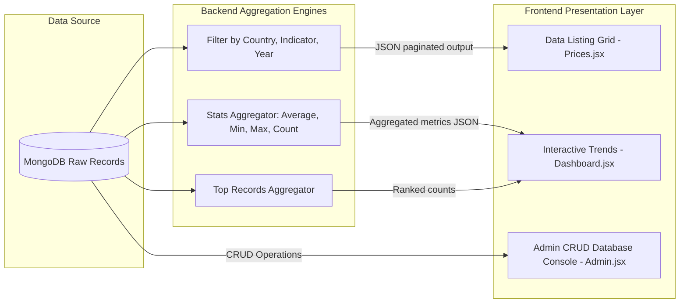

# 📊 Human Capital Analytics & Management Platform

Welcome to the **Human Capital** platform! This documentation is designed to give anyone—whether a developer, product manager, financial analyst, or policy maker—a complete conceptual and technical understanding of what this application does, why it exists, and how the entire system connects together.

---

## 💡 What is the "Human Capital" Project?

### 1. The Core Concept
**Human Capital** refers to the economic value of a worker's experience, skills, knowledge, and health. Understanding human capital trends requires monitoring cost of living, consumer price fluctuations, purchasing power parity, and labor market metrics across different regions.

This platform serves as a **centralized intelligence directory and analytics panel** for global economic indicators. It processes a dataset containing over **190,000+ records** covering index values across **190 countries**.

### 2. Who is it for?
*   **Economic Researchers**: To analyze and compare multi-year index values and cost-of-living fluctuations globally.
*   **Enterprise HR & Financial Analysts**: To track regional pricing indexes, cost of labor factors, and salary adjustments.
*   **System Administrators**: To manage the underlying data entries and govern user roles.

---

## 🗺️ System Architecture & Data Flow

Below is a diagrammatic representation of how users, the React Client, the Express API Server, and the MongoDB database interact.

### 1. High-Level System Workflow
This diagram illustrates the user authentication and role-based authorization path when requesting pages and data.



---

### 2. The Data Processing Pipeline
This diagram displays how raw dataset records from MongoDB are fetched, filtered, and aggregated before being rendered as interactive visualizations.



---

## 🔑 User Journeys & Roles

The platform supports two distinct user personas, each with unique pathways and system permissions:

```
                  ┌──────────────────────────────┐
                  │          Guest User          │
                  └──────────────┬───────────────┘
                                 │
                        [ Register / Login ]
                                 │
                                 ▼
                  ┌──────────────────────────────┐
                  │      Authenticated User      │
                  └──────────────┬───────────────┘
                                 ├──────────────────────────────┐
                                 ▼                              ▼
                  ┌──────────────────────────────┐┌──────────────────────────────┐
                  │      👤 Standard User        ││         👑 Admin User        │
                  │   (Read-Only Analytics)      ││     (Full Database CRUD)     │
                  └──────────────┬───────────────┘└──────────────┬───────────────┘
                                 │                              │
                     - View Analytics Overview      - Access Admin Panel
                     - Search Countries & Trends    - Create / Edit / Delete Users
                     - Export dataset pages         - Create / Edit / Delete Prices
```

### 👤 Persona A: Standard User
*   **Action Flow**: Logs in $\rightarrow$ Lands on the **Analytics Dashboard** $\rightarrow$ Explores global records by country or indicator using the **Search Engine** $\rightarrow$ Filters, searches, and exports subsets of the price index dataset in the **Data Listing Dashboard**.
*   **Permissions**: Read-only access to analytics data. Cannot modify users or database entries.

### 👑 Persona B: Admin User
*   **Action Flow**: Logs in $\rightarrow$ Navigates to the **Administrative Console** $\rightarrow$ Performs User CRUD (adds/removes users) or Price CRUD (adds/updates price entries) $\rightarrow$ Instantly updates the global data pool.
*   **Permissions**: Full Read, Write, Update, and Delete (CRUD) access on database models.

---

## 📁 Repository Structure

```bash
human_capital_project_atul_kumar_singh/
├── frontend/                 # React Client Application
│   ├── src/
│   │   ├── components/      # UI Shell, Sidebar navigation, Top bar header
│   │   ├── context/         # AuthContext (stores session token, current theme, compact tables toggles)
│   │   ├── hooks/           # useFetch Hook (abstraction for async request states)
│   │   ├── pages/           # Visual modules (Dashboard, Admin, Profile, Settings)
│   │   ├── services/        # api.js client (injects JWT tokens automatically)
│   │   └── index.css        # Core styling layout framework & visual system
│   ├── package.json
│   └── vite.config.js
│
├── backend/                  # RESTful API Backend
│   ├── src/
│   │   ├── config/          # db.js Mongoose configuration
│   │   ├── controllers/     # Controller logic handlers (auth, user CRUD, stats aggregations)
│   │   ├── middlewares/     # rateLimiters, errorHandler, authGuard, request logs
│   │   ├── models/          # User.js (credentials & roles) and Price.js (dataset schema)
│   │   └── routes/          # Express routing files
│   └── server.js            # Node listener entry point
```

---

## ⚙️ Core Modules & Features

### 1. Analytics Dashboard (`Dashboard.jsx`)
Provides visual representation of human capital indexes. Uses **Recharts** to plot:
*   Global Average prices and index values.
*   Highest and lowest indicators.
*   Record volumes grouped by country using interactive bar charts.

### 2. Data Listing Dashboard (`Prices.jsx`)
An interactive, high-performance data explorer table:
*   Allows sorting by value, year, and country.
*   Supports live filters for country codes, year ranges, and indicator categories.
*   Enables client-side exports of the filtered page details to JSON files.

### 3. Administrative Console (`Admin.jsx`)
A restricted control center containing:
*   **MongoDB User CRUD**: Create, read, update, and delete registered profiles. Self-deletion protection prevents administrators from accidentally locked-out states.
*   **MongoDB Prices CRUD**: Allows adding, updating, and removing raw dataset index records in MongoDB.

### 4. Settings & Theme Swapping (`Settings.jsx`)
Allows users to switch layout defaults:
*   **Visual Theme Swapper**: Modifies CSS custom properties instantly (Default Dark, Purple Midnight, Cyberpunk Green).
*   **Compact Mode**: Toggles table padding limits for high-density information displays.

---

## 💻 Technical Setup & Local Execution

### Prerequisites
*   [Node.js](https://nodejs.org) (v18 or higher recommended)
*   [MongoDB Atlas Account](https://www.mongodb.com/cloud/atlas) or a local running MongoDB instance.

### 1. Environment Configurations

#### Backend Environment (`backend/.env`)
Create a `.env` file inside the `backend/` directory:
```env
PORT=5000
MONGODB_URI=your_mongodb_atlas_connection_uri
NODE_ENV=development
JWT_SECRET=your_custom_jwt_signing_key_string
JWT_EXPIRE=30d
CORS_ORIGIN=*
```

#### Frontend Environment (`frontend/.env`)
Create a `.env` file inside the `frontend/` directory:
```env
VITE_API_URL=http://localhost:5000/api/v1
```

### 2. Run the Application

#### Step A: Launch the Backend Server
```bash
cd backend
npm install
npm run dev
```
*The REST API will launch on `http://localhost:5000/api/v1`.*

#### Step B: Seed Default User Accounts
To immediately test the user profiles, execute the database seeding script:
```bash
cd backend
node check-or-create-admin.js
```
This inserts two testing accounts:
*   **👑 Admin User**: `admin@example.com` / `admin123`
*   **👤 Regular User**: `user@example.com` / `user123`

#### Step C: Launch the React Client
```bash
cd ../frontend
npm install
npm run dev
```
*Open `http://localhost:5173` in your browser to view the application.*
